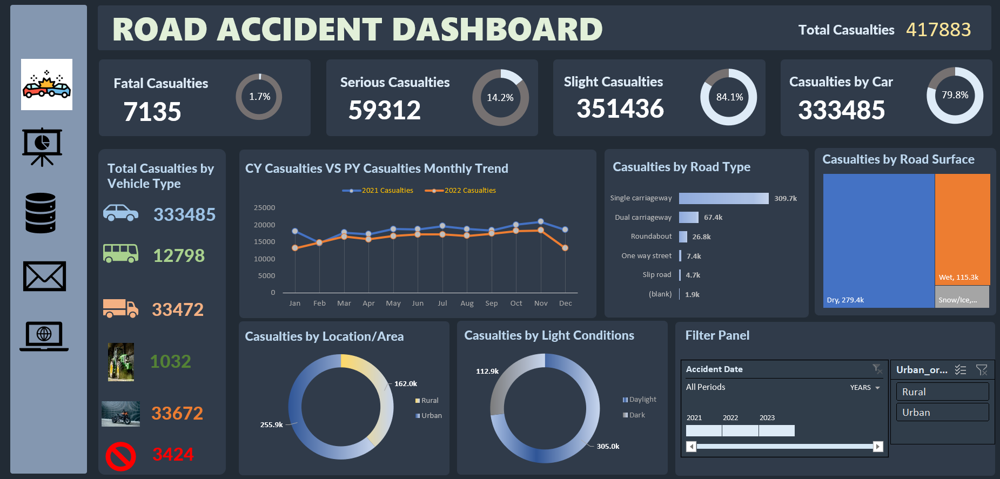

# 🚦 Road Accident Dashboard – Excel

This Excel dashboard delivers comprehensive insights into road accident casualties for the years 2021 and 2022. It visualizes data across vehicle types, road conditions, locations, and time to help stakeholders identify trends and develop strategies to enhance public road safety.

---

## 🧩 Problem Statement

The objective of this project is to analyze accident data to understand the **severity, causes, and distribution of road casualties**. This dashboard supports decision-making for road safety planning, policy design, and emergency service response by addressing questions like:

- How many total casualties occurred in 2021 and 2022?
- What percentage of casualties are fatal, serious, or slight?
- Which vehicle types contribute to the most casualties?
- What road types and surface conditions are most dangerous?
- How do casualty rates differ by location and time of day?

---

## 📌 KPIs Tracked

### 🔹 Primary KPIs
- **Total Casualties** – Overall number of casualties across all vehicle types.
- **Fatal Casualties** – Number and % of life-losing accidents.
- **Serious Casualties** – Number and % of major injuries.
- **Slight Casualties** – Number and % of minor injuries.
- **Casualties by Cars** – Vehicle type with maximum impact.

### 🔹 Secondary KPIs
- **Casualties by Vehicle Type** – Car, Bus, Van, Bike, Pedestrian, etc.
- **Monthly Casualty Trend** – Current Year (CY) vs Previous Year (PY).
- **Casualties by Road Type** – Single, Dual Carriageway, Roundabout, etc.
- **Casualties by Road Surface** – Dry, Wet, Snow/Ice.
- **Casualties by Area** – Urban vs Rural.
- **Casualties by Light Conditions** – Daylight vs Dark.

---

## 📊 Visualizations

| Visualization Type                | Purpose                                                             |
|----------------------------------|---------------------------------------------------------------------|
| KPI Cards                        | Displays Fatal, Serious, Slight Casualties, and Total Count         |
| Line Chart                       | Shows CY vs PY monthly trends in casualties                         |
| Bar Chart                        | Highlights casualties by Road Type and Vehicle Type                 |
| Treemap                          | Illustrates distribution by Road Surface                            |
| Donut Charts                     | Breaks down data by Area (Urban/Rural) and Light Condition          |
| Filter Panel                     | Enables filtering by year and location                              |

---

## 🔧 Features & Tools Used

- **Excel (.xlsx)** as data source
- **Power Query Editor** – Data transformation and shaping
- **DAX Measures**:
  - `CALCULATE`, `FILTER`, `SUMX`, `DIVIDE`
  - Custom percentage calculations by severity and category
- **Date Filtering** – Timeline slicer to compare across years
- **Data Modeling** – Relationships across date, location, and vehicle type

---

## 💼 Stakeholders

- **Ministry of Transport**
- **Road Transport Department**
- **Police Force**
- **Emergency Services**
- **Road Safety Corps**
- **Transport Operators**
- **Traffic Management Agencies**
- **Public & Media**

---

## 📁 Files Included

- `Road_accident_Dashboard.png` – Snapshot of the dashboard
- `Road Accident Analysis.xlsx` – Source dataset
- `Road_Accident_Requirments.txt` – Stakeholder requirements and KPI details

---

## 🧠 Key Insights

- **Slight Casualties** represent **84.1%** of all accidents.
- **Cars** are involved in nearly **80%** of total casualties.
- **Single Carriageways** and **Dry road surfaces** are linked with the highest accidents.
- **Urban areas** have nearly **60%** more casualties than rural areas.
- Most incidents occur in **daylight**, indicating behavioral factors over visibility.

---

## 🚀 Future Enhancements

- Integrate a **geo-map view** for region-wise accident hotspots.
- Enable **predictive analytics** for casualty risk based on past data.
- Include **real-time data feeds** from traffic and emergency services.
- Incorporate **demographic factors** (e.g., age, gender) if available.

---

